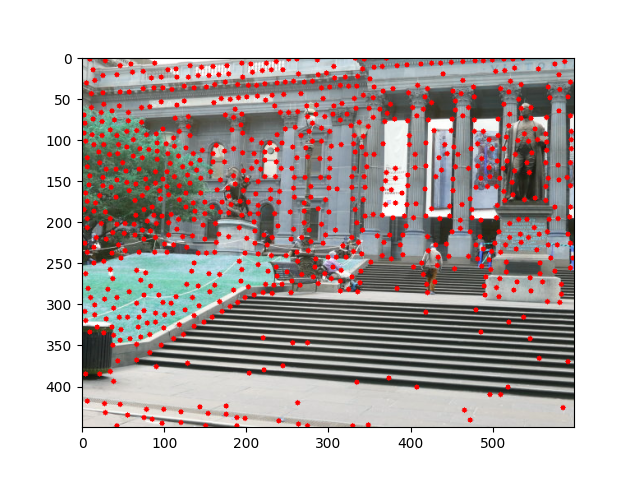
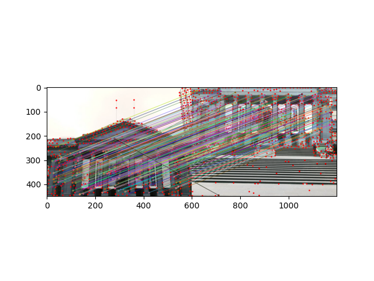
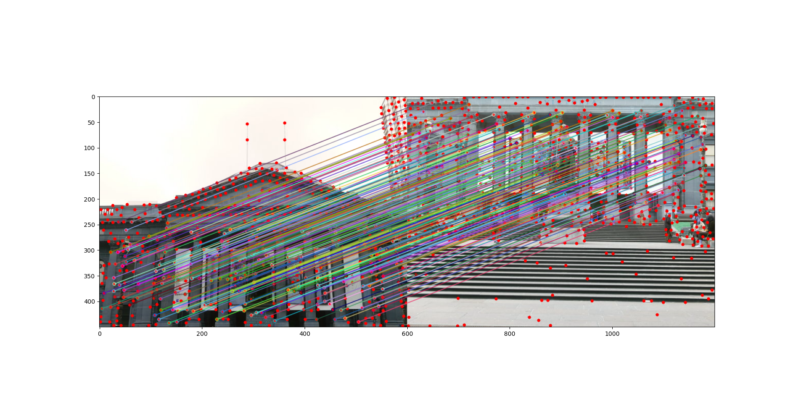
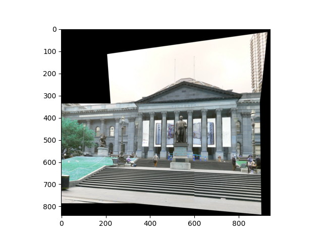
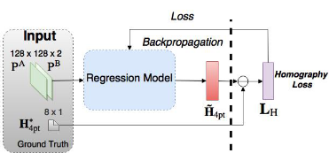
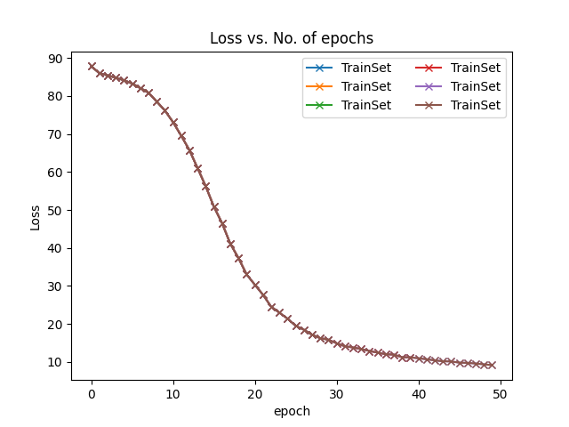
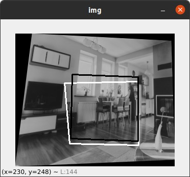
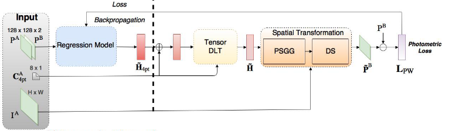

# StitchingImagesAutoPano
Stitching Images to create one seamless panorama image using Homography.

## My AutoPano
The purpose of this project is to stitch two or more images in order to create one seamless panorama image by finding the Homography between the two images. 
The project is divided into two phases,
1. Phase 1: Classical approach of local feature matching
2. Phase 2: Deep Learning approach(Homography Net - supervised and unsupervised) to estimate the homography.

### Team Members

- Mandeep Singh
- Chinmay Kate

## **Phase 1 - Using Classical CV **
Implemented traditional CV pipeline combines algorithms of corner detection, ANMS, feature extraction,
feature matching, RANSAC, homography estimation and blending.

### Results

#### Corner Detection and Non Maximal Suppression


#### Feature Matching


#### Outlier Rejection using RANSAC


#### Warping, Blending and Stitching


### Usage Guidelines

1. Open directory Phase1/Code and run the following command with the Data location as command line argument: -

    ```
    python3 Wrapper.py --DataPath Set1
    ```

    Above command will load Set1 images which needs to be stitched.

2. `Results` folder contains stitched images of all Trainsets and TestSets.

## **Phase 2 - using Deep Learning**
In Deep learning, used Homography Net (both supervised and unsupervised) to estimate the homography.

### DataSet Generation
To generate dataset, run the following command in Phase2/Code/supervised: -
    ```
    python3 Wrapper.py
    ```

### Supervised Homography



#### Result

##### Training Loss


##### Input and Output Patch



1. To train the network, run: -
    ```
    python3 Train.py
    ```

2. To test the model on test set, run: -
    ```
    python3 Test.py
    ```

### Unsupervised Homography



1. To train the network, run: -
    ```
    python3 Train.py
    ```

2. To test the model on trainset , run: -
    ```
    python3 Test.py
    ```

## References

1. https://rbe549.github.io/fall2022/hw/hw0/
2. https://arxiv.org/pdf/1606.03798.pdf
3. https://arxiv.org/abs/1709.03966
